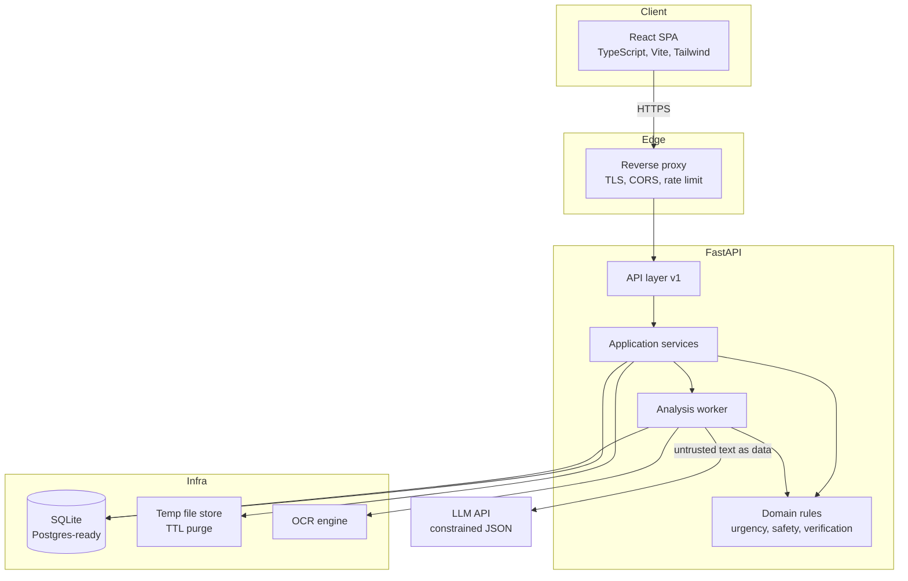
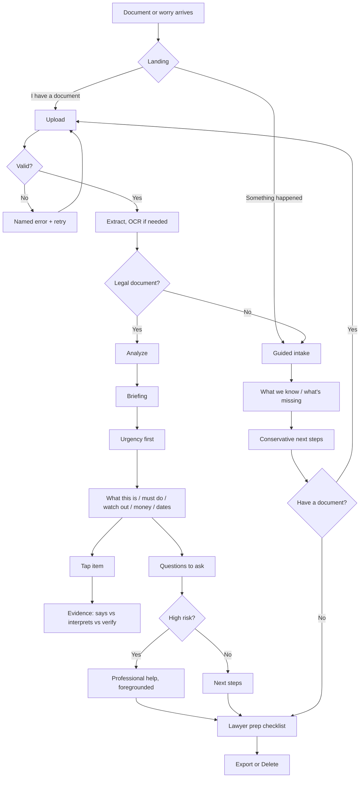
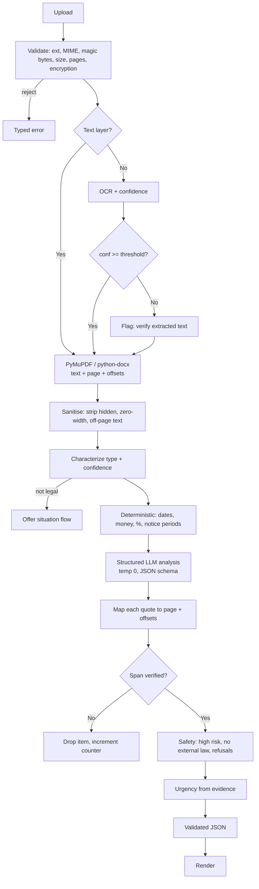
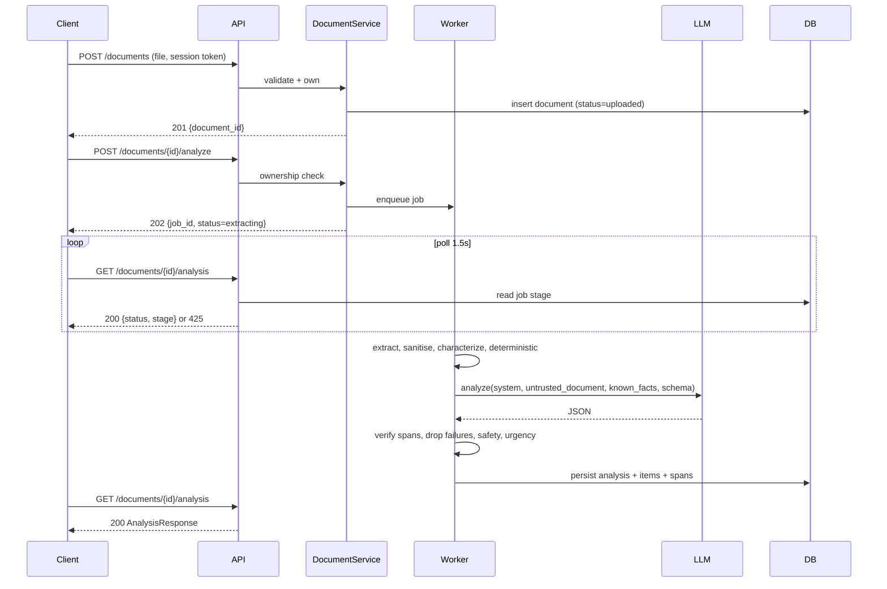
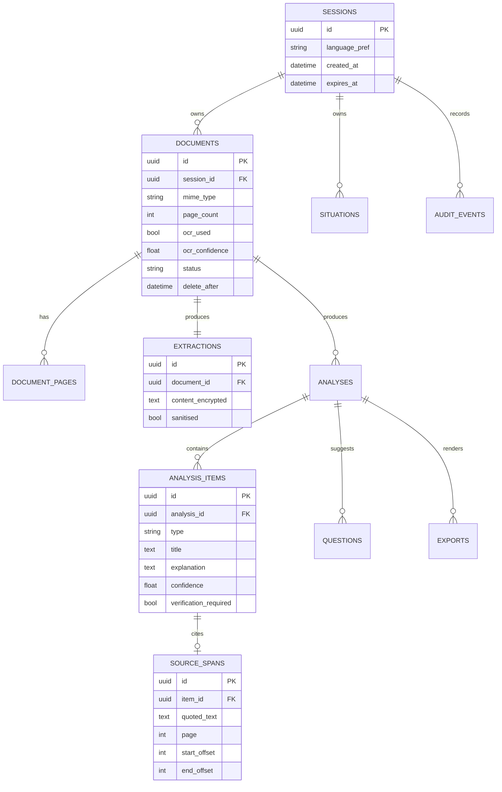
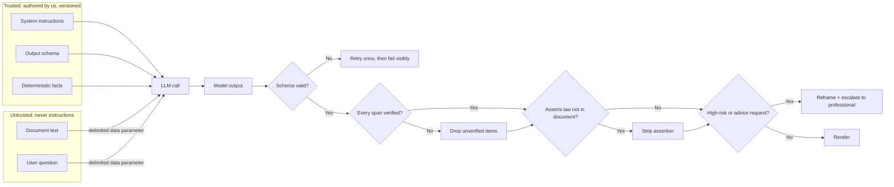
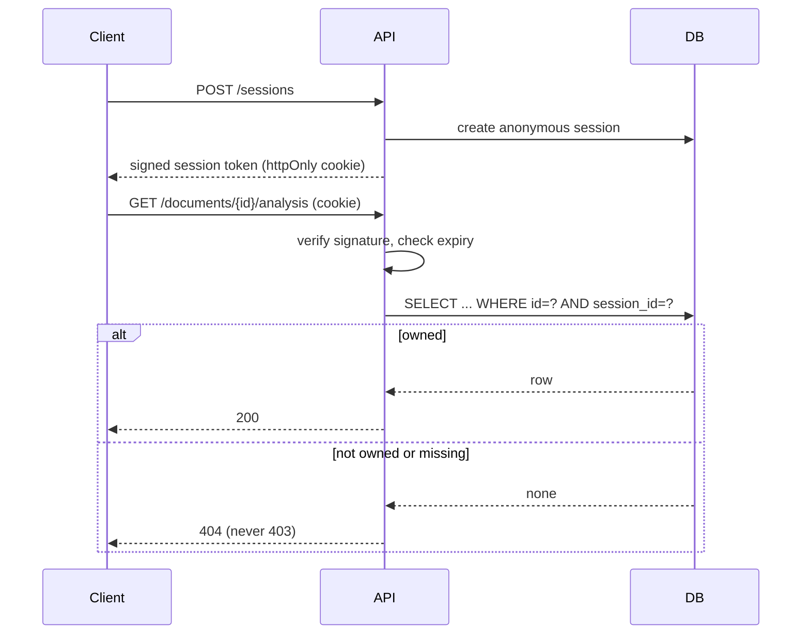
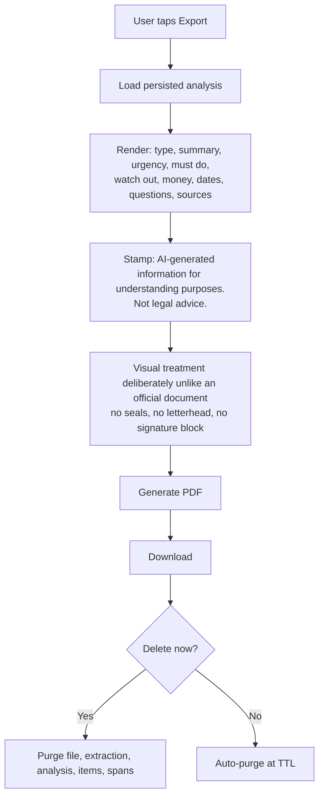

# Samjo: Architecture Diagrams

## 1. System architecture

The LLM is the only external dependency. It receives document text as a delimited data parameter and never as instructions.

## 2. User journey

## 3. Document analysis pipeline

## 4. Backend request flow

## 5. Database ER

## 6. AI safety boundary

Secrets never enter the prompt, so there is nothing for a system-prompt-leak attack to retrieve beyond authored instructions.

## 7. Session and authorization flow

Ownership is enforced in the service layer on every read, write and delete. Client-supplied document ids are never trusted.

## 8. Export flow

## 9. Rate Limiting, TTL and Data Lifecycle

### Rate Limiter Architecture (MVP Specification)
The MVP uses an in-memory sliding-window rate limiter (`backend.app.core.ratelimit.InMemoryRateLimiter`) enforcing per-session and per-IP quotas:
- `POST /sessions`: 20/hour/IP
- `POST /documents`: 10/hour/session
- `POST /documents/{id}/analyze`: 15/hour/session (cost centre)
- `POST /situations`: 10/hour/session
- Reads & Polling: 600/hour/session (headroom for 1.5s client polling)
- `DELETE /documents/{id}`: 30/hour/session
- Concurrency: Maximum 1 concurrent analysis per session, maximum 3 concurrent analyses per process.

**MVP Limitation Note:**
Because this rate limiter is held in memory, counters reset whenever the application process restarts or deploys. For the MVP deployment on a single Render instance, this provides robust protection against abusive loops and runaway Gemini billing without introducing external infrastructure. In a multi-instance production environment, this in-memory layer can be swapped for a Redis-backed distributed token bucket without altering the FastAPI route dependency contracts.

### Data Lifecycle & TTL Rules
- **Document TTL:** Every uploaded document is assigned a hard expiration timestamp (`delete_after = created_at + 24 hours`).
- **Session TTL:** Sessions expire after 72 hours (`SESSION_TTL_HOURS = 72`).
- **Background Reaper:** A lightweight asynchronous background task runs every 30 seconds:
  1. Reaps stuck analysis jobs running > 120 seconds, transitioning them to `failed` (`ANALYSIS_TIMEOUT`) to prevent zombie client polling.
  2. Purges expired documents past `delete_after`.
  3. Purges expired sessions and orphaned resources.
- **Immediate Deletion & Cascades:** When a user clicks "Delete it now" (`DELETE /documents/{id}`):
  - Database foreign-key cascades (`ON DELETE CASCADE`) immediately purge the document, its encrypted extraction, decrypted pages, analysis result, and source spans.
  - Ephemeral disk files (if any remain) are purged immediately.
  - Subsequent requests return HTTP 404.

